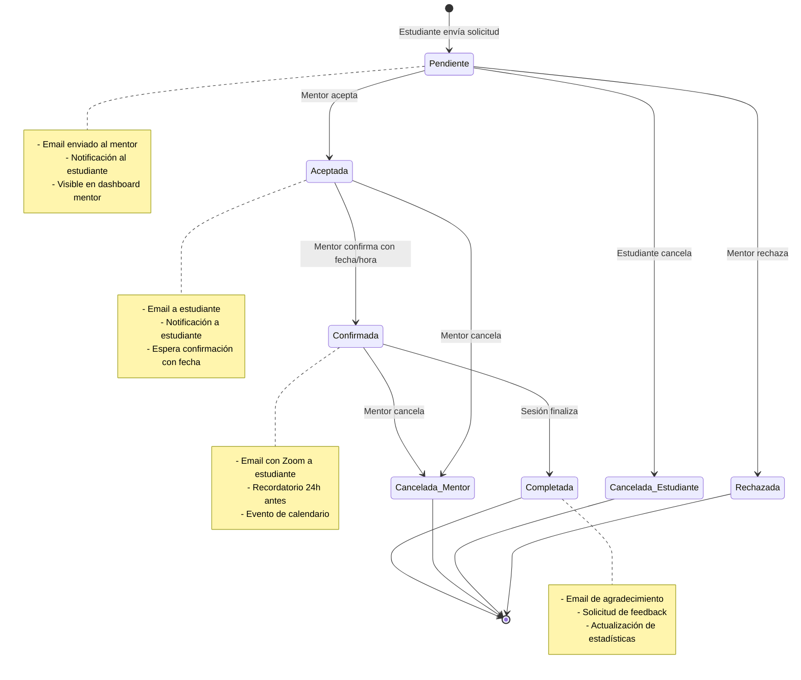

# Flujo de Solicitudes de Mentoría

## Descripción General

Este documento describe el flujo completo de una solicitud de mentoría desde que el estudiante la envía hasta que se completa la sesión, incluyendo todos los estados, validaciones y notificaciones involucradas.

## Diagrama de Estados



## Flujo Detallado

### 1. Creación de Solicitud

**Actor:** Estudiante

**Precondiciones:**
- Estudiante autenticado
- Mentor disponible (disponibilidad = true)
- Mentor con CV verificado
- No existe solicitud pendiente/aceptada del mismo estudiante al mismo mentor

**Proceso:**
1. Estudiante navega a "Mentores Disponibles"
2. Busca mentor por nombre, especialidad o skills
3. Clic en "Contactar Mentor"
4. Completa formulario con mensaje personalizado
5. Envía solicitud

**Validaciones:**
```php
// SolicitudMentoriaRequest
[
    'mentor_id' => ['required', 'exists:users,id', new MentorDisponible],
    'mensaje' => ['required', 'string', 'min:20', 'max:500'],
]

// Regla personalizada: MentorDisponible
- Verifica que mentor->disponibilidad === true
- Verifica que mentor->cv_verified === true
- Verifica que no haya solicitud pendiente/aceptada previa
```

**Acciones del Sistema:**
1. Crear registro en tabla `solicitudes_mentoria`:
   ```sql
   INSERT INTO solicitudes_mentoria (
       aprendiz_id,
       mentor_id,
       mensaje,
       estado,
       created_at
   ) VALUES (?, ?, ?, 'pendiente', NOW())
   ```

2. Disparar evento `SolicitudCreada`:
   - Enviar email al mentor
   - Crear notificación para estudiante (confirmación de envío)
   - Crear notificación para mentor (nueva solicitud)

3. Retornar respuesta:
   ```json
   {
       "message": "Solicitud enviada exitosamente",
       "solicitud": {
           "id": 123,
           "estado": "pendiente",
           "created_at": "2024-01-15T10:00:00Z"
       }
   }
   ```

**Estado Resultante:** `pendiente`

**Notificaciones:**
- ✉️ Email a mentor: "Nueva solicitud de mentoría"
- 🔔 Notificación a estudiante: "Solicitud enviada correctamente"
- 🔔 Notificación a mentor: "Nueva solicitud de [Nombre Estudiante]"

---

### 2. Aceptación de Solicitud

**Actor:** Mentor

**Precondiciones:**
- Mentor autenticado
- Solicitud en estado `pendiente`
- Solicitud pertenece al mentor

**Proceso:**
1. Mentor navega a "Mis Solicitudes"
2. Revisa solicitud con mensaje del estudiante
3. Clic en "Aceptar Solicitud"
4. Confirma acción

**Validaciones:**
```php
// En MentorSolicitudesController
- Verificar que solicitud->estado === 'pendiente'
- Verificar que solicitud->mentor_id === Auth::id()
- Verificar que solicitud no haya expirado (opcional, ej: 7 días)
```

**Acciones del Sistema:**
1. Actualizar estado de solicitud:
   ```sql
   UPDATE solicitudes_mentoria
   SET estado = 'aceptada',
       updated_at = NOW()
   WHERE id = ? AND mentor_id = ? AND estado = 'pendiente'
   ```

2. Disparar evento `SolicitudAceptada`:
   - Enviar email al estudiante
   - Crear notificación para estudiante
   - Crear notificación para mentor (recordatorio para confirmar fecha)

3. Retornar respuesta:
   ```json
   {
       "message": "Solicitud aceptada. Ahora debes confirmar fecha y hora.",
       "solicitud": {
           "id": 123,
           "estado": "aceptada"
       }
   }
   ```

**Estado Resultante:** `aceptada`

**Notificaciones:**
- ✉️ Email a estudiante: "Tu solicitud ha sido aceptada"
- 🔔 Notificación a estudiante: "[Mentor] aceptó tu solicitud"
- 🔔 Notificación a mentor: "No olvides confirmar fecha y hora"

---

### 3. Rechazo de Solicitud

**Actor:** Mentor

**Precondiciones:**
- Mentor autenticado
- Solicitud en estado `pendiente`
- Solicitud pertenece al mentor

**Proceso:**
1. Mentor navega a "Mis Solicitudes"
2. Revisa solicitud con mensaje del estudiante
3. Clic en "Rechazar Solicitud"
4. Opcionalmente ingresa motivo
5. Confirma acción

**Validaciones:**
```php
// En MentorSolicitudesController
- Verificar que solicitud->estado === 'pendiente'
- Verificar que solicitud->mentor_id === Auth::id()
- Motivo es opcional, pero recomendado
```

**Acciones del Sistema:**
1. Actualizar estado de solicitud:
   ```sql
   UPDATE solicitudes_mentoria
   SET estado = 'rechazada',
       motivo_rechazo = ?,
       updated_at = NOW()
   WHERE id = ? AND mentor_id = ? AND estado = 'pendiente'
   ```

2. Disparar evento `SolicitudRechazada`:
   - Enviar email al estudiante
   - Crear notificación para estudiante

3. Retornar respuesta:
   ```json
   {
       "message": "Solicitud rechazada",
       "solicitud": {
           "id": 123,
           "estado": "rechazada"
       }
   }
   ```

**Estado Resultante:** `rechazada` (final)

**Notificaciones:**
- ✉️ Email a estudiante: "Tu solicitud ha sido rechazada"
- 🔔 Notificación a estudiante: "[Mentor] rechazó tu solicitud"

---

### 4. Confirmación de Mentoría

**Actor:** Mentor

**Precondiciones:**
- Mentor autenticado
- Solicitud en estado `aceptada`
- Solicitud pertenece al mentor
- Credenciales de Zoom configuradas (ZOOM_ACCOUNT_ID, ZOOM_CLIENT_ID, ZOOM_CLIENT_SECRET)

**Proceso:**
1. Mentor navega a "Mis Solicitudes"
2. Selecciona solicitud aceptada
3. Clic en "Confirmar Mentoría"
4. Completa formulario:
   - Fecha (mínimo: mañana)
   - Hora (formato 24h)
   - Duración (30/60/90 minutos)
5. Envía confirmación

**Validaciones:**
```php
// ConfirmarMentoriaRequest
[
    'solicitud_id' => ['required', 'exists:solicitudes_mentoria,id'],
    'fecha' => ['required', 'date', 'after:today'],
    'hora' => ['required', 'date_format:H:i'],
    'duracion' => ['required', 'integer', 'in:30,60,90'],
]

// Validaciones adicionales
- Verificar que solicitud->estado === 'aceptada'
- Verificar que mentor no tenga otra mentoría en el mismo horario
- Verificar que fecha+hora sea al menos 24 horas en el futuro
```

**Acciones del Sistema:**
1. Crear reunión de Zoom:
   ```php
   $zoomService = new ZoomApiService();
   $meeting = $zoomService->createMeeting([
       'topic' => "Mentoría: {$mentor->name} - {$estudiante->name}",
       'start_time' => "{$fecha} {$hora}",
       'duration' => $duracion,
       'timezone' => 'America/Mexico_City',
   ]);
   ```

2. Crear registro de mentoría:
   ```sql
   INSERT INTO mentorias (
       solicitud_id,
       fecha_hora,
       zoom_meeting_id,
       zoom_join_url,
       zoom_password,
       duracion,
       estado,
       created_at
   ) VALUES (?, ?, ?, ?, ?, ?, 'confirmada', NOW())
   ```

3. Actualizar estado de solicitud:
   ```sql
   UPDATE solicitudes_mentoria
   SET estado = 'confirmada',
       updated_at = NOW()
   WHERE id = ?
   ```

4. Disparar evento `MentoriaConfirmada`:
   - Enviar email a estudiante con enlace de Zoom
   - Crear notificación para estudiante
   - Crear notificación para mentor (confirmación)
   - Programar job de recordatorio para 24h antes

5. Retornar respuesta:
   ```json
   {
       "message": "Mentoría confirmada exitosamente",
       "mentoria": {
           "id": 456,
           "fecha_hora": "2024-01-20T10:00:00Z",
           "zoom_join_url": "https://zoom.us/j/123456789",
           "zoom_password": "abc123"
       }
   }
   ```

**Estado Resultante:** `confirmada`

**Notificaciones:**
- ✉️ Email a estudiante: "Mentoría confirmada - Detalles de reunión"
- ✉️ Email a mentor: "Confirmación de mentoría creada"
- 🔔 Notificación a estudiante: "Mentoría confirmada para [fecha]"
- 🔔 Notificación a mentor: "Mentoría confirmada con [estudiante]"
- ⏰ Job programado: Recordatorio 24h antes

**Manejo de Errores:**
```php
try {
    $meeting = $zoomService->createMeeting($data);
} catch (ZoomApiException $e) {
    Log::error('Error creando reunión Zoom', [
        'mentor_id' => $mentor->id,
        'error' => $e->getMessage()
    ]);
    
    return back()->withErrors([
        'zoom' => 'Error al crear reunión de Zoom. Verifica tu configuración.'
    ]);
} catch (ZoomAuthException $e) {
    Log::error('Error de autenticación Zoom', [
        'mentor_id' => $mentor->id,
        'error' => $e->getMessage()
    ]);
    
    return back()->withErrors([
        'zoom' => 'Credenciales de Zoom inválidas. Contacta al administrador.'
    ]);
}
```

---

### 5. Recordatorio de Mentoría

**Actor:** Sistema (Scheduled Job)

**Precondiciones:**
- Mentoría en estado `confirmada`
- Fecha de mentoría dentro de las próximas 24 horas
- Recordatorio no enviado previamente

**Proceso:**
1. Job `EnviarRecordatorioMentoriaJob` se ejecuta cada hora
2. Busca mentorías que cumplan las condiciones
3. Envía recordatorios

**Lógica del Job:**
```php
public function handle()
{
    $mentorias = Mentoria::where('estado', 'confirmada')
        ->where('recordatorio_enviado', false)
        ->whereBetween('fecha_hora', [
            now(),
            now()->addHours(24)
        ])
        ->with(['solicitud.aprendiz', 'solicitud.mentor'])
        ->get();

    foreach ($mentorias as $mentoria) {
        // Email a estudiante
        Mail::to($mentoria->solicitud->aprendiz->email)
            ->send(new RecordatorioMentoria($mentoria, 'aprendiz'));
        
        // Email a mentor
        Mail::to($mentoria->solicitud->mentor->email)
            ->send(new RecordatorioMentoria($mentoria, 'mentor'));
        
        // Notificaciones
        $mentoria->solicitud->aprendiz->notify(
            new RecordatorioMentoriaNotification($mentoria)
        );
        
        $mentoria->solicitud->mentor->notify(
            new RecordatorioMentoriaNotification($mentoria)
        );
        
        // Marcar como enviado
        $mentoria->update(['recordatorio_enviado' => true]);
        
        Log::info('Recordatorio enviado', [
            'mentoria_id' => $mentoria->id,
            'fecha_hora' => $mentoria->fecha_hora
        ]);
    }
}
```

**Programación:**
```php
// App\Console\Kernel
protected function schedule(Schedule $schedule)
{
    $schedule->job(new EnviarRecordatorioMentoriaJob)
        ->hourly()
        ->withoutOverlapping()
        ->onOneServer();
}
```

**Notificaciones:**
- ✉️ Email a estudiante: "Recordatorio: Mentoría mañana a las [hora]"
- ✉️ Email a mentor: "Recordatorio: Mentoría mañana a las [hora]"
- 🔔 Notificación a estudiante: "Tu mentoría es en 24 horas"
- 🔔 Notificación a mentor: "Mentoría programada en 24 horas"

---

### 6. Cancelación por Mentor

**Actor:** Mentor

**Precondiciones:**
- Mentor autenticado
- Solicitud en estado `aceptada` o `confirmada`
- Solicitud pertenece al mentor

**Proceso:**
1. Mentor navega a "Mis Solicitudes" o "Mis Mentorías"
2. Selecciona solicitud/mentoría
3. Clic en "Cancelar"
4. Opcionalmente ingresa motivo
5. Confirma acción

**Validaciones:**
```php
// En MentorSolicitudesController
- Verificar que solicitud->estado in ['aceptada', 'confirmada']
- Verificar que solicitud->mentor_id === Auth::id()
- Motivo es opcional, pero recomendado
```

**Acciones del Sistema:**
1. Si hay mentoría confirmada, cancelar reunión de Zoom:
   ```php
   if ($mentoria = $solicitud->mentoria) {
       $zoomService->deleteMeeting($mentoria->zoom_meeting_id);
       
       $mentoria->update([
           'estado' => 'cancelada',
           'motivo_cancelacion' => $request->motivo,
           'cancelada_por' => 'mentor',
           'cancelada_at' => now()
       ]);
   }
   ```

2. Actualizar estado de solicitud:
   ```sql
   UPDATE solicitudes_mentoria
   SET estado = 'cancelada_mentor',
       motivo_cancelacion = ?,
       updated_at = NOW()
   WHERE id = ? AND mentor_id = ?
   ```

3. Disparar evento `MentoriaCancelada`:
   - Enviar email urgente al estudiante
   - Crear notificación para estudiante
   - Registrar en log para estadísticas

4. Retornar respuesta:
   ```json
   {
       "message": "Mentoría cancelada",
       "solicitud": {
           "id": 123,
           "estado": "cancelada_mentor"
       }
   }
   ```

**Estado Resultante:** `cancelada_mentor` (final)

**Notificaciones:**
- ✉️ Email a estudiante: "Tu mentoría ha sido cancelada"
- 🔔 Notificación a estudiante: "[Mentor] canceló la mentoría"

---

### 7. Cancelación por Estudiante

**Actor:** Estudiante

**Precondiciones:**
- Estudiante autenticado
- Solicitud en estado `pendiente`, `aceptada` o `confirmada`
- Solicitud pertenece al estudiante

**Proceso:**
1. Estudiante navega a "Mis Solicitudes"
2. Selecciona solicitud
3. Clic en "Cancelar Solicitud"
4. Confirma acción

**Validaciones:**
```php
// En StudentSolicitudesController
- Verificar que solicitud->estado in ['pendiente', 'aceptada', 'confirmada']
- Verificar que solicitud->aprendiz_id === Auth::id()
- Si estado es 'confirmada', verificar que falten más de 24h para la mentoría
```

**Acciones del Sistema:**
1. Si hay mentoría confirmada, cancelar reunión de Zoom:
   ```php
   if ($mentoria = $solicitud->mentoria) {
       if ($mentoria->fecha_hora->diffInHours(now()) < 24) {
           return back()->withErrors([
               'cancelacion' => 'No puedes cancelar con menos de 24h de anticipación'
           ]);
       }
       
       $zoomService->deleteMeeting($mentoria->zoom_meeting_id);
       
       $mentoria->update([
           'estado' => 'cancelada',
           'cancelada_por' => 'aprendiz',
           'cancelada_at' => now()
       ]);
   }
   ```

2. Actualizar estado de solicitud:
   ```sql
   UPDATE solicitudes_mentoria
   SET estado = 'cancelada_aprendiz',
       updated_at = NOW()
   WHERE id = ? AND aprendiz_id = ?
   ```

3. Disparar evento `SolicitudCancelada`:
   - Enviar email al mentor
   - Crear notificación para mentor

4. Retornar respuesta:
   ```json
   {
       "message": "Solicitud cancelada exitosamente",
       "solicitud": {
           "id": 123,
           "estado": "cancelada_aprendiz"
       }
   }
   ```

**Estado Resultante:** `cancelada_aprendiz` (final)

**Notificaciones:**
- ✉️ Email a mentor: "El estudiante canceló la solicitud"
- 🔔 Notificación a mentor: "[Estudiante] canceló la solicitud"

---

### 8. Completar Mentoría

**Actor:** Sistema (Automático) / Mentor (Manual)

**Precondiciones:**
- Mentoría en estado `confirmada`
- Fecha de mentoría ha pasado

**Proceso Automático:**
1. Job `CompletarMentoriasJob` se ejecuta cada 30 minutos
2. Busca mentorías confirmadas cuya fecha_hora + duración haya pasado
3. Marca como completadas

**Lógica del Job:**
```php
public function handle()
{
    $mentorias = Mentoria::where('estado', 'confirmada')
        ->where('fecha_hora', '<', now()->subHour())
        ->with(['solicitud.aprendiz', 'solicitud.mentor'])
        ->get();

    foreach ($mentorias as $mentoria) {
        $mentoria->update(['estado' => 'completada']);
        
        $mentoria->solicitud->update(['estado' => 'completada']);
        
        // Emails
        Mail::to($mentoria->solicitud->aprendiz->email)
            ->send(new MentoriaCompletada($mentoria));
        
        // Notificaciones
        $mentoria->solicitud->aprendiz->notify(
            new MentoriaCompletadaNotification($mentoria)
        );
        
        // Actualizar estadísticas
        $this->actualizarEstadisticas($mentoria);
        
        Log::info('Mentoría completada', [
            'mentoria_id' => $mentoria->id
        ]);
    }
}

private function actualizarEstadisticas(Mentoria $mentoria)
{
    // Incrementar contador de mentorías del mentor
    $mentor = $mentoria->solicitud->mentor;
    $mentor->increment('mentorias_completadas');
    
    // Incrementar contador de mentorías del estudiante
    $aprendiz = $mentoria->solicitud->aprendiz;
    $aprendiz->increment('mentorias_recibidas');
}
```

**Proceso Manual (Opcional):**
1. Mentor navega a "Mis Mentorías"
2. Selecciona mentoría confirmada
3. Clic en "Marcar como Completada"
4. Confirma acción

**Estado Resultante:** `completada` (final)

**Notificaciones:**
- ✉️ Email a estudiante: "Gracias por tu mentoría - Comparte tu feedback"
- 🔔 Notificación a estudiante: "Tu mentoría se ha completado"

---

## Validaciones por Estado

### Tabla de Transiciones Permitidas

| Estado Actual | Transiciones Permitidas | Actor |
|--------------|------------------------|-------|
| `pendiente` | → `aceptada`<br>→ `rechazada`<br>→ `cancelada_aprendiz` | Mentor<br>Mentor<br>Estudiante |
| `aceptada` | → `confirmada`<br>→ `cancelada_mentor`<br>→ `cancelada_aprendiz` | Mentor<br>Mentor<br>Estudiante |
| `confirmada` | → `completada`<br>→ `cancelada_mentor`<br>→ `cancelada_aprendiz` | Sistema/Mentor<br>Mentor<br>Estudiante (con restricción de 24h) |
| `rechazada` | (estado final) | - |
| `cancelada_*` | (estado final) | - |
| `completada` | (estado final) | - |

### Validaciones de Negocio

#### Solicitud Pendiente
```php
// No puede haber más de una solicitud pendiente/aceptada del mismo estudiante al mismo mentor
SolicitudMentoria::where('aprendiz_id', $estudianteId)
    ->where('mentor_id', $mentorId)
    ->whereIn('estado', ['pendiente', 'aceptada', 'confirmada'])
    ->exists(); // debe ser false
```

#### Confirmación de Mentoría
```php
// Fecha debe ser al menos mañana
$fecha->isAfter(today());

// Fecha+hora debe ser al menos 24h en el futuro
Carbon::parse("{$fecha} {$hora}")->isAfter(now()->addHours(24));

// Mentor no puede tener otra mentoría en el mismo horario
$horaInicio = Carbon::parse("{$fecha} {$hora}");
$horaFin = $horaInicio->copy()->addMinutes($duracion);

Mentoria::where('mentor_id', $mentorId)
    ->where('estado', 'confirmada')
    ->where(function($q) use ($horaInicio, $horaFin) {
        $q->whereBetween('fecha_hora', [$horaInicio, $horaFin])
          ->orWhere(function($q2) use ($horaInicio, $horaFin) {
              $q2->where('fecha_hora', '<=', $horaInicio)
                 ->whereRaw('DATE_ADD(fecha_hora, INTERVAL duracion MINUTE) >= ?', [$horaInicio]);
          });
    })
    ->exists(); // debe ser false
```

#### Cancelación por Estudiante
```php
// Si estado es 'confirmada', debe faltar más de 24h
if ($solicitud->estado === 'confirmada') {
    $mentoria = $solicitud->mentoria;
    
    if ($mentoria->fecha_hora->diffInHours(now()) < 24) {
        throw new \Exception('No puedes cancelar con menos de 24h de anticipación');
    }
}
```

## Notificaciones por Estado

### Resumen de Notificaciones

| Estado | Email Estudiante | Email Mentor | Notificación Estudiante | Notificación Mentor |
|--------|-----------------|--------------|------------------------|---------------------|
| `pendiente` | ✅ Confirmación | ✅ Nueva solicitud | ✅ | ✅ |
| `aceptada` | ✅ Solicitud aceptada | ✅ Recordatorio confirmar | ✅ | ✅ |
| `rechazada` | ✅ Solicitud rechazada | - | ✅ | - |
| `confirmada` | ✅ Detalles de reunión | ✅ Confirmación | ✅ | ✅ |
| `recordatorio` | ✅ 24h antes | ✅ 24h antes | ✅ | ✅ |
| `cancelada_*` | ✅ Cancelación | ✅ Cancelación | ✅ | ✅ |
| `completada` | ✅ Agradecimiento | - | ✅ | - |

## Logs y Auditoría

### Eventos Registrados

Todos los cambios de estado se registran en el log de Laravel:

```php
Log::info('Cambio de estado de solicitud', [
    'solicitud_id' => $solicitud->id,
    'estado_anterior' => $estadoAnterior,
    'estado_nuevo' => $estadoNuevo,
    'actor' => Auth::user()->id,
    'timestamp' => now()
]);
```

### Métricas Importantes

#### Dashboard de Administrador

- Total de solicitudes por estado
- Tasa de aceptación (aceptadas / pendientes)
- Tasa de rechazo (rechazadas / total)
- Tasa de cancelación (canceladas / confirmadas)
- Tasa de completación (completadas / confirmadas)
- Tiempo promedio entre solicitud y aceptación
- Tiempo promedio entre aceptación y confirmación

#### Dashboard de Mentor

- Solicitudes pendientes
- Solicitudes aceptadas (esperando confirmación)
- Mentorías confirmadas próximas
- Mentorías completadas (histórico)
- Tasa de completación personal

#### Dashboard de Estudiante

- Solicitudes enviadas
- Solicitudes aceptadas
- Mentorías confirmadas próximas
- Mentorías completadas (histórico)

## Troubleshooting

### Solicitud no se puede enviar

**Error:** "Ya tienes una solicitud pendiente con este mentor"

**Causa:** Existe solicitud previa en estado pendiente/aceptada/confirmada

**Solución:**
1. Cancelar solicitud previa
2. Esperar a que mentor responda
3. Contactar a otro mentor

### Confirmación de mentoría falla

**Error:** "Error al crear reunión de Zoom"

**Causa:** Credenciales de Zoom incorrectas o expiradas

**Solución:**
1. Verificar variables de entorno ZOOM_*
2. Regenerar credenciales en Zoom Marketplace
3. Contactar administrador del sistema

### Recordatorio no se envió

**Causa:** Job no se ejecutó o mentoría ya tenía recordatorio_enviado = true

**Solución:**
1. Verificar que el cron de Laravel esté corriendo: `* * * * * cd /path-to-project && php artisan schedule:run >> /dev/null 2>&1`
2. Revisar logs: `storage/logs/laravel.log`
3. Ejecutar manualmente: `php artisan queue:work --queue=emails`

### Cancelación con menos de 24h

**Error:** "No puedes cancelar con menos de 24h de anticipación"

**Causa:** Política de cancelación

**Solución:**
1. Contactar directamente al mentor vía email
2. Contactar soporte para casos excepcionales

## Próximas Mejoras

- [ ] Reagendamiento de mentorías (sin cancelar)
- [ ] Sistema de calificaciones y reviews post-mentoría
- [ ] Mentorías recurrentes (semanales/mensuales)
- [ ] Reprogramación automática si mentor cancela
- [ ] Sugerencias de mentores similares al rechazar/cancelar
- [ ] Estadísticas avanzadas de mentorías por área de conocimiento
- [ ] Integración con Google Calendar / Outlook
- [ ] Chat en vivo durante la mentoría
