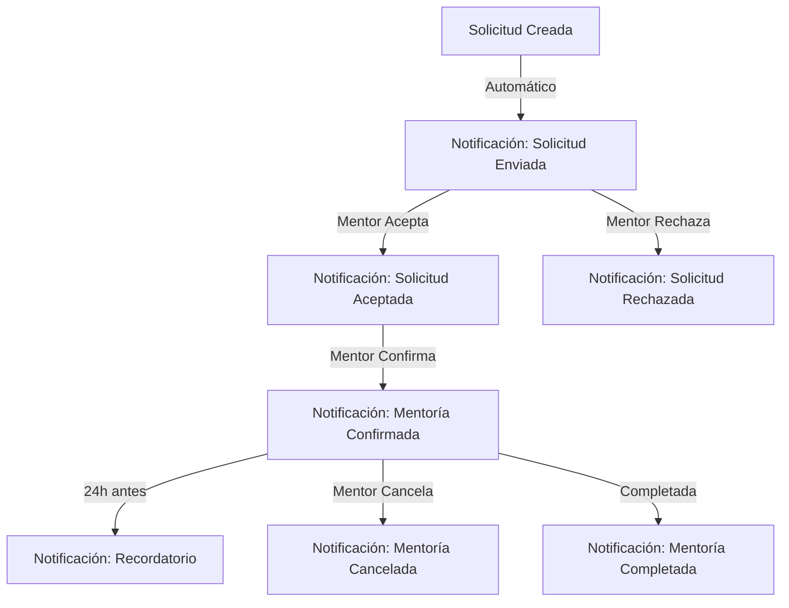

# Sistema de Notificaciones para Estudiantes

## Descripción General

El sistema de notificaciones mantiene informados a los estudiantes sobre el estado de sus solicitudes de mentoría y eventos importantes relacionados con sus mentorías activas.

## Flujo de Notificaciones

### Estados de Solicitud y Notificaciones



### Tipos de Notificaciones

#### 1. Solicitud Enviada
**Cuándo:** Inmediatamente después de crear la solicitud

**Contenido:**
- Confirmación de envío
- Nombre del mentor contactado
- Tiempo estimado de respuesta (48 horas)

**Canales:**
- Notificación in-app
- Email

#### 2. Solicitud Aceptada
**Cuándo:** Cuando el mentor acepta la solicitud

**Contenido:**
- Confirmación de aceptación
- Próximos pasos (esperar confirmación con fecha/hora)
- Datos del mentor

**Canales:**
- Notificación in-app
- Email
- Push notification (si está habilitado)

#### 3. Solicitud Rechazada
**Cuándo:** Cuando el mentor rechaza la solicitud

**Contenido:**
- Información de rechazo
- Motivo (si el mentor lo proporcionó)
- Sugerencia para buscar otros mentores

**Canales:**
- Notificación in-app
- Email

#### 4. Mentoría Confirmada
**Cuándo:** Cuando el mentor confirma con fecha, hora y enlace Zoom

**Contenido:**
- Fecha y hora de la mentoría
- Enlace de Zoom
- Contraseña de la reunión
- Botón para agregar al calendario
- Datos del mentor

**Canales:**
- Notificación in-app
- Email con enlace de Zoom
- Push notification

#### 5. Recordatorio de Mentoría
**Cuándo:** 24 horas antes de la mentoría

**Contenido:**
- Recordatorio de fecha/hora
- Enlace de Zoom
- Botón "Unirse ahora" (si está dentro del tiempo permitido)

**Canales:**
- Notificación in-app
- Email
- Push notification

#### 6. Mentoría Cancelada
**Cuándo:** Cuando el mentor cancela la mentoría

**Contenido:**
- Información de cancelación
- Motivo (si el mentor lo proporcionó)
- Opción para solicitar nueva mentoría

**Canales:**
- Notificación in-app
- Email urgente

#### 7. Mentoría Completada
**Cuándo:** Después de que la mentoría se marca como completada

**Contenido:**
- Agradecimiento por participar
- Invitación a dejar feedback
- Opción para solicitar nueva mentoría

**Canales:**
- Notificación in-app
- Email

## Endpoints API

### Obtener Notificaciones del Estudiante

```http
GET /student/notifications
```

**Autenticación:** Requerida (estudiante)

**Respuesta:**
```json
{
  "notifications": [
    {
      "id": 1,
      "type": "solicitud_aceptada",
      "title": "Solicitud aceptada",
      "message": "Juan Pérez ha aceptado tu solicitud de mentoría",
      "data": {
        "solicitud_id": 123,
        "mentor_name": "Juan Pérez"
      },
      "read_at": null,
      "created_at": "2024-01-15T10:30:00Z"
    }
  ],
  "unread_count": 3
}
```

### Obtener Solicitudes del Estudiante

```http
GET /student/solicitudes
```

**Autenticación:** Requerida (estudiante)

**Respuesta:**
```json
{
  "solicitudes": [
    {
      "id": 123,
      "mentor": {
        "id": 45,
        "name": "Juan Pérez",
        "email": "juan@example.com"
      },
      "estado": "aceptada",
      "mensaje": "Me gustaría aprender sobre Laravel",
      "created_at": "2024-01-15T10:00:00Z",
      "updated_at": "2024-01-15T11:00:00Z"
    }
  ]
}
```

### Polling de Solicitudes (Actualizaciones en Tiempo Real)

```http
GET /api/student/solicitudes
```

**Autenticación:** Requerida (estudiante)

**Rate Limit:** 60 peticiones por minuto

**Respuesta:**
```json
{
  "solicitudes": [...],
  "last_update": "2024-01-15T12:00:00Z"
}
```

**Uso en Frontend:**
```javascript
// Polling cada 30 segundos
useEffect(() => {
  const interval = setInterval(() => {
    axios.get('/api/student/solicitudes')
      .then(response => {
        setSolicitudes(response.data.solicitudes);
      });
  }, 30000);
  
  return () => clearInterval(interval);
}, []);
```

### Marcar Notificación como Leída

```http
POST /student/notifications/{id}/read
```

**Autenticación:** Requerida (estudiante)

**Parámetros:**
- `id`: ID de la notificación

**Respuesta:**
```json
{
  "message": "Notificación marcada como leída",
  "notification": {
    "id": 1,
    "read_at": "2024-01-15T12:30:00Z"
  }
}
```

### Marcar Todas las Notificaciones como Leídas

```http
POST /student/notifications/read-all
```

**Autenticación:** Requerida (estudiante)

**Respuesta:**
```json
{
  "message": "Todas las notificaciones marcadas como leídas",
  "count": 5
}
```

## Componentes Frontend

### `NotificationBell.jsx`

Campana de notificaciones en la barra de navegación.

**Props:**
- `unreadCount`: Número de notificaciones no leídas

**Estado:**
- `notifications`: Array de notificaciones
- `isOpen`: Estado del dropdown de notificaciones

**Ejemplo de uso:**
```jsx
<NotificationBell unreadCount={notifications.filter(n => !n.read_at).length} />
```

### `NotificationList.jsx`

Lista de notificaciones con opciones de filtrado.

**Props:**
- `notifications`: Array de notificaciones
- `onMarkAsRead`: Callback para marcar como leída
- `onMarkAllAsRead`: Callback para marcar todas como leídas

**Ejemplo de uso:**
```jsx
<NotificationList
  notifications={notifications}
  onMarkAsRead={handleMarkAsRead}
  onMarkAllAsRead={handleMarkAllAsRead}
/>
```

### `NotificationItem.jsx`

Item individual de notificación.

**Props:**
- `notification`: Objeto de notificación
- `onRead`: Callback al hacer clic

**Tipos de Notificación:**
- `solicitud_enviada`: Azul, icono de envío
- `solicitud_aceptada`: Verde, icono de check
- `solicitud_rechazada`: Rojo, icono de X
- `mentoria_confirmada`: Verde, icono de calendario
- `mentoria_recordatorio`: Amarillo, icono de campana
- `mentoria_cancelada`: Rojo, icono de advertencia
- `mentoria_completada`: Verde, icono de estrella

### `SolicitudesList.jsx`

Lista de solicitudes del estudiante con estados.

**Props:**
- `solicitudes`: Array de solicitudes
- `onRefresh`: Callback para refrescar

**Estados visuales:**
- `pendiente`: Badge amarillo
- `aceptada`: Badge verde claro
- `rechazada`: Badge rojo
- `confirmada`: Badge verde oscuro
- `completada`: Badge azul

**Ejemplo de uso:**
```jsx
<SolicitudesList
  solicitudes={solicitudes}
  onRefresh={fetchSolicitudes}
/>
```

## Plantillas de Email

### Email de Solicitud Aceptada

**Archivo:** `resources/views/emails/solicitud-aceptada.blade.php`

**Variables:**
```php
[
    'student_name' => 'Nombre del estudiante',
    'mentor_name' => 'Nombre del mentor',
    'solicitud_id' => 123,
    'mensaje_original' => 'Texto de la solicitud'
]
```

**Contenido:**
- Saludo personalizado
- Confirmación de aceptación
- Próximos pasos
- Datos de contacto del soporte

### Email de Mentoría Confirmada

**Archivo:** `resources/views/emails/mentoria-confirmada.blade.php`

**Variables:**
```php
[
    'student_name' => 'Nombre del estudiante',
    'mentor_name' => 'Nombre del mentor',
    'fecha_hora' => '2024-01-20 10:00',
    'zoom_link' => 'https://zoom.us/j/123456789',
    'zoom_password' => 'abc123',
    'calendar_link' => 'URL del evento de calendario'
]
```

**Contenido:**
- Detalles de la reunión
- Enlace de Zoom destacado
- Contraseña de la reunión
- Botón "Agregar al calendario"
- Instrucciones de conexión

### Email de Recordatorio

**Archivo:** `resources/views/emails/mentoria-recordatorio.blade.php`

**Variables:**
```php
[
    'student_name' => 'Nombre del estudiante',
    'mentor_name' => 'Nombre del mentor',
    'tiempo_restante' => '24 horas',
    'fecha_hora' => '2024-01-20 10:00',
    'zoom_link' => 'https://zoom.us/j/123456789'
]
```

**Contenido:**
- Recordatorio urgente
- Tiempo restante hasta la mentoría
- Enlace de Zoom
- Botón "Unirse ahora"
- Checklist de preparación

## Guía de Usuario para Estudiantes

### Dónde Ver Notificaciones

#### 1. Dashboard Principal
- Sección "Notificaciones Recientes" en la parte superior
- Muestra las últimas 5 notificaciones
- Badge rojo indica notificaciones no leídas

#### 2. Campana de Notificaciones
- Ubicada en la barra de navegación superior derecha
- Badge numérico muestra cantidad de notificaciones no leídas
- Clic abre dropdown con lista de notificaciones

#### 3. Página de Notificaciones
- Acceso desde menú principal → "Notificaciones"
- Lista completa de todas las notificaciones
- Filtros por tipo y estado (leída/no leída)
- Paginación para historial completo

### Dónde Ver Solicitudes

#### 1. Dashboard - Sección "Mis Solicitudes"
- Vista rápida del estado de solicitudes activas
- Estados: Pendiente, Aceptada, Rechazada, Confirmada

#### 2. Página "Mis Solicitudes"
- Acceso desde menú principal → "Mis Solicitudes"
- Lista detallada con filtros por estado
- Opción de cancelar solicitudes pendientes
- Historial completo de solicitudes

### Cómo Leer una Notificación

1. **Clic en la Campana de Notificaciones**
   - Se abre el dropdown con lista de notificaciones

2. **Clic en una Notificación**
   - Se marca automáticamente como leída
   - Se navega a la página relacionada (si aplica)

3. **Botón "Marcar todas como leídas"**
   - Marca todas las notificaciones como leídas de una vez

### Tipos de Acciones Disponibles

#### Desde Notificación de Solicitud Aceptada
- **Ver detalles:** Navega a la solicitud
- **Contactar mentor:** Abre modal de contacto (si ya tiene relación previa)

#### Desde Notificación de Mentoría Confirmada
- **Ver detalles:** Navega a los detalles de la mentoría
- **Agregar al calendario:** Descarga archivo .ics
- **Unirse a reunión:** Abre enlace de Zoom (si está en el tiempo permitido)

#### Desde Notificación de Recordatorio
- **Unirse ahora:** Abre enlace de Zoom directamente
- **Ver detalles:** Navega a los detalles de la mentoría

### Configuración de Notificaciones

#### Preferencias de Email
- Acceso desde "Perfil" → "Preferencias de Notificaciones"
- Opciones:
  - ✅ Recibir emails de solicitudes aceptadas
  - ✅ Recibir emails de mentorías confirmadas
  - ✅ Recibir recordatorios de mentorías
  - ❌ Recibir emails de mentorías completadas

#### Notificaciones Push
- Acceso desde "Perfil" → "Preferencias de Notificaciones"
- Requiere permitir notificaciones en el navegador
- Opciones:
  - ✅ Notificaciones de solicitudes
  - ✅ Recordatorios de mentorías
  - ❌ Notificaciones de mensajes

## Troubleshooting

### No recibo notificaciones por email

**Solución:**
1. Verificar carpeta de spam/correo no deseado
2. Agregar `noreply@tusistema.com` a contactos
3. Verificar preferencias de notificaciones en el perfil
4. Contactar soporte si el problema persiste

### No veo notificaciones en la campana

**Solución:**
1. Refrescar la página (F5)
2. Verificar conexión a internet
3. Cerrar sesión y volver a iniciar
4. Limpiar caché del navegador

### El contador de notificaciones no se actualiza

**Solución:**
1. Hacer clic en "Marcar todas como leídas"
2. Refrescar la página
3. El sistema se sincroniza cada 30 segundos automáticamente

## Documentación Técnica

### Event Listeners

#### `MentoriaConfirmada`

**Dispara:**
- `EnviarCorreoMentoriaConfirmada` (mail)
- `CrearNotificacionMentoriaConfirmada` (notification)

**Datos del evento:**
```php
public function __construct(
    public SolicitudMentoria $solicitud,
    public array $zoomData
) {}
```

#### `SolicitudAceptada`

**Dispara:**
- `EnviarCorreoSolicitudAceptada` (mail)
- `CrearNotificacionSolicitudAceptada` (notification)

### Jobs

#### `EnviarRecordatorioMentoriaJob`

**Cuándo:** 24 horas antes de la mentoría

**Lógica:**
```php
$mentorias = Mentoria::where('fecha_hora', '>=', now())
    ->where('fecha_hora', '<=', now()->addHours(24))
    ->where('estado', 'confirmada')
    ->where('recordatorio_enviado', false)
    ->get();

foreach ($mentorias as $mentoria) {
    Mail::to($mentoria->aprendiz->email)
        ->send(new RecordatorioMentoria($mentoria));
    
    $mentoria->update(['recordatorio_enviado' => true]);
}
```

**Programación:**
```php
// En App\Console\Kernel
protected function schedule(Schedule $schedule)
{
    $schedule->job(new EnviarRecordatorioMentoriaJob)
        ->hourly();
}
```

### Modelos

#### Notification

**Campos:**
- `id`: UUID
- `type`: Tipo de notificación
- `notifiable_type`: Clase del modelo notificable
- `notifiable_id`: ID del modelo notificable
- `data`: JSON con datos de la notificación
- `read_at`: Timestamp de lectura
- `created_at`: Timestamp de creación

**Relaciones:**
```php
public function notifiable(): MorphTo
{
    return $this->morphTo();
}
```

## Próximas Mejoras

- [ ] WebSockets para notificaciones en tiempo real
- [ ] Notificaciones push nativas (PWA)
- [ ] Agrupación de notificaciones similares
- [ ] Snooze de notificaciones
- [ ] Preferencias granulares por tipo de notificación
- [ ] Centro de notificaciones con búsqueda y filtros avanzados
- [ ] Exportar historial de notificaciones
